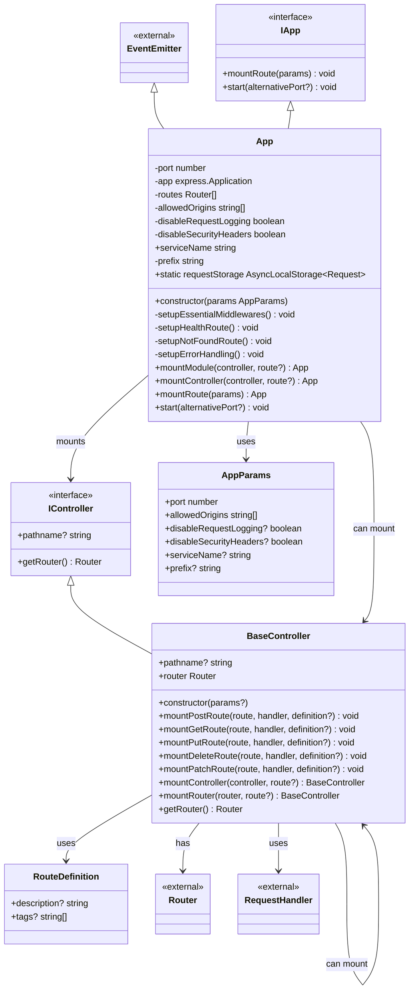

# Class Diagram for App and BaseController

## Class Descriptions

### App Class

- **Inherits from**: `EventEmitter`, implements `IApp`
- **Purpose**: Main application class that manages Express server setup, middleware, and route mounting
- **Key Features**:
  - CORS configuration
  - Security headers (Helmet)
  - Request logging (Morgan)
  - Health check endpoint
  - Error handling
  - Route mounting system

### BaseController Class

- **Implements**: `IController`
- **Purpose**: Base class for creating controllers with common HTTP method routing
- **Key Features**:
  - HTTP method routing (GET, POST, PUT, DELETE, PATCH)
  - Nested controller mounting
  - Router management
  - Built-in ping endpoint

### Relationships

- **App** can mount **BaseController** instances using `mountController()`
- **BaseController** can mount other **BaseController** instances for nested routing
- Both classes work with Express **Router** instances
- **App** implements the **IApp** interface
- **BaseController** implements the **IController** interface
